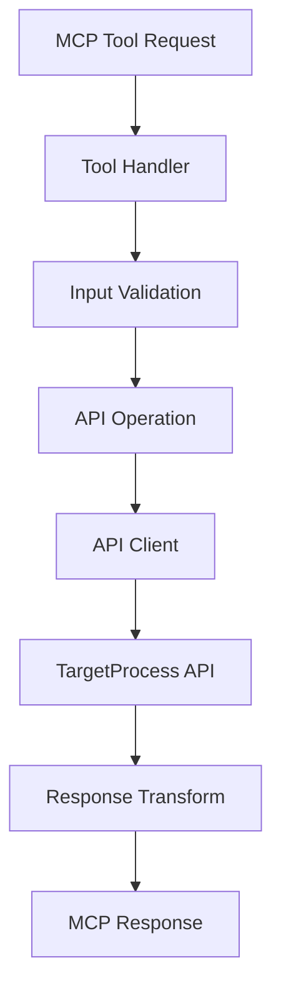

# TargetProcess MCP Architecture

This document outlines the architecture of the TargetProcess MCP server, designed to align with TargetProcess's API structure and entity hierarchy.

## Development Tools

### Documentation Search
The repository includes a documentation scraper/searcher (`resources/target-process-docs`) that provides a local search interface for Targetprocess's developer documentation. This tool is essential for development as it allows quick access to API documentation, entity relationships, and implementation details.

## Directory Structure

```mermaid
graph TD
    A[src/] --> B[entities/]
    A --> C[api/]
    A --> D[tools/]
    
    B --> B1[base/]
    B --> B2[assignable/]
    B --> B3[project/]
    
    B1 --> B1_1[general.entity.ts]
    B1 --> B1_2[base.types.ts]
    
    B2 --> B2_1[assignable.entity.ts]
    B2 --> B2_2[user-story.entity.ts]
    B2 --> B2_3[task.entity.ts]
    B2 --> B2_4[bug.entity.ts]
    B2 --> B2_5[feature.entity.ts]
    
    B3 --> B3_1[project.entity.ts]
    B3 --> B3_2[team.entity.ts]
    B3 --> B3_3[iteration.entity.ts]
    
    C --> C1[client/]
    C --> C2[operations/]
    C --> C3[collections/]
    
    C1 --> C1_1[api.client.ts]
    C1 --> C1_2[auth.client.ts]
    
    C2 --> C2_1[crud.operations.ts]
    C2 --> C2_2[search.operations.ts]
    C2 --> C2_3[filter.operations.ts]
    
    C3 --> C3_1[collection.handler.ts]
    C3 --> C3_2[paging.handler.ts]
    
    D --> D1[search/]
    D --> D2[entity/]
    D --> D3[update/]
    
    D1 --> D1_1[search.tool.ts]
    D1 --> D1_2[search.schema.ts]
    
    D2 --> D2_1[get.tool.ts]
    D2 --> D2_2[create.tool.ts]
    D2 --> D2_3[entity.schema.ts]
    
    D3 --> D3_1[update.tool.ts]
    D3 --> D3_2[update.schema.ts]
```

## Architecture Overview

The architecture is organized into three main layers:

### 1. Entities Layer (`/src/entities`)

Models the TargetProcess entity hierarchy:

- **base/**: Core entity types
  - `general.entity.ts`: Base entity class with common properties
  - `base.types.ts`: Shared type definitions

- **assignable/**: Assignable entity types
  - `assignable.entity.ts`: Base class for assignable entities
  - Entity-specific implementations (UserStory, Bug, Task, etc.)

- **project/**: Project-related entities
  - Project, Team, and Iteration implementations

### 2. API Layer (`/src/api`)

Handles API communication and operations:

- **client/**: API client implementation
  - `tp.service.ts`: TargetProcess service layer with API operations and access token authentication

- **operations/**: API operations
  - `crud.operations.ts`: Create, Read, Update, Delete
  - `search.operations.ts`: Search functionality
  - `filter.operations.ts`: Filter operations

- **collections/**: Collection handling
  - `collection.handler.ts`: Collection management
  - `paging.handler.ts`: Pagination logic

### 3. Tools Layer (`/src/tools`)

MCP tool implementations:

- **search/**: Search functionality
  - `search.tool.ts`: Search tool implementation
  - `search.schema.ts`: Search input validation

- **entity/**: Entity operations
  - `get.tool.ts`: Entity retrieval
  - `create.tool.ts`: Entity creation
  - `entity.schema.ts`: Entity validation schemas

- **update/**: Update operations
  - `update.tool.ts`: Update tool implementation
  - `update.schema.ts`: Update validation schemas

## Data Flow

## Key Benefits

1. **Natural API Mapping**: Structure mirrors TargetProcess's API
2. **Clear Entity Relationships**: Hierarchy is explicit in the structure
3. **Modular Design**: Each component has a single responsibility
4. **Extensibility**: Easy to add new entities or operations
5. **Maintainability**: Changes are localized to relevant modules

## Implementation Notes

- Each entity extends from appropriate base classes
- Validation schemas ensure data integrity
- API operations are grouped by functionality
- Tools provide high-level interface for MCP
