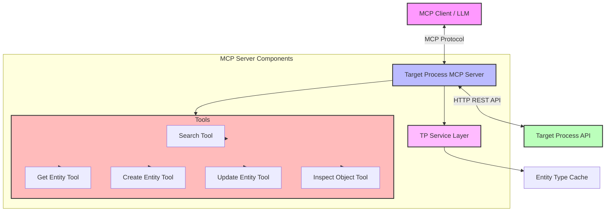
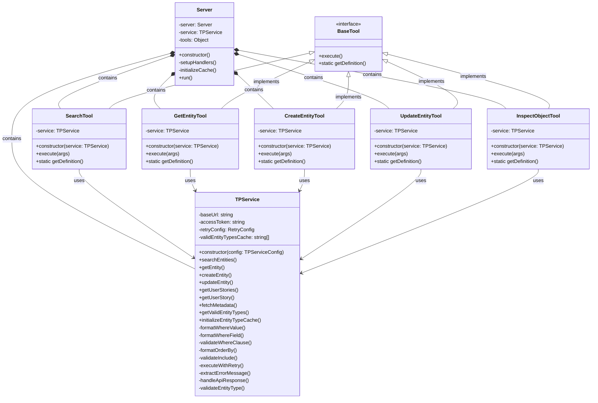
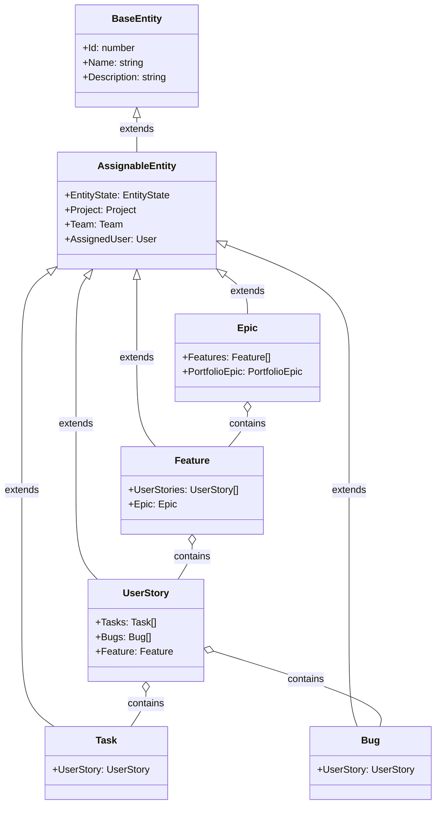
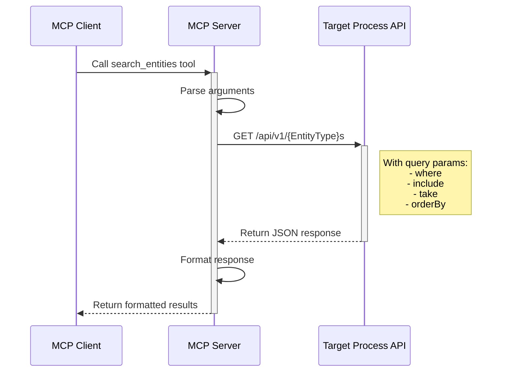
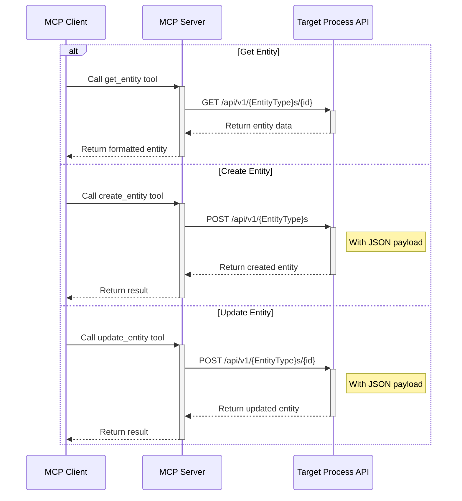
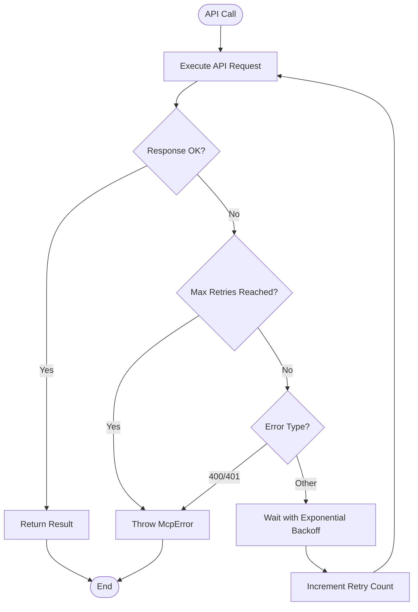
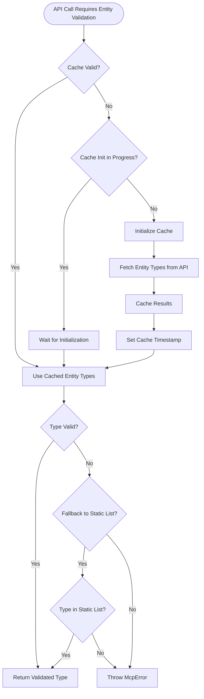

# Target Process MCP Architecture

This document outlines the architecture of the Target Process Model Context Protocol (MCP) implementation, including system structure, class diagrams, and transaction models.

## System Overview

The Target Process MCP server provides an interface between Large Language Models (LLMs) and the Target Process API, enabling AI assistants to perform operations such as searching, retrieving, creating, and updating Target Process entities.

## System Architecture

## Class Diagram

## Entity Data Models

## Transaction Models

### Search Flow

### Entity CRUD Operations

### Error Handling and Retry Logic

## Configuration and Initialization

The Target Process MCP server can be configured in two ways:

1. **Environment Variables:**
   - `TP_DOMAIN`: Target Process domain (e.g., "company.tpondemand.com")
   - `TP_ACCESS_TOKEN`: Personal access token for authentication

2. **Configuration File:**
   - Located at `config/targetprocess.json`
   - Contains domain and credential information

During initialization, the server:

1. Loads configuration
2. Initializes the TP Service with configuration
3. Creates tool instances
4. Sets up MCP request handlers
5. Initializes entity type cache in the background

## Caching Strategy

The server maintains a cache of valid entity types to improve performance:

## Conclusion

The Target Process MCP architecture follows a layered approach with clean separation of concerns:

1. **MCP Server Layer**: Handles communication with the MCP client
2. **Tool Layer**: Implements specific operations as MCP tools
3. **Service Layer**: Provides reusable API communication logic
4. **API Layer**: Communicates with the Target Process REST API

This architecture ensures maintainability, extensibility, and robust error handling throughout the system.
